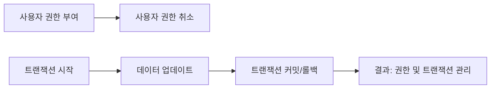

# DCL과 TCL 상세 사용 예시 및 실습

## DCL (Data Control Language) 소개

DCL(Data Control Language)은 데이터베이스 내에서 사용자 권한을 관리하는 데 사용되는 SQL의 일부입니다.

### 주요 DCL 명령어

- **GRANT**: 사용자에게 특정 권한을 부여합니다.
- **REVOKE**: 사용자의 권한을 제거합니다.

## TCL (Transaction Control Language) 소개

TCL(Transaction Control Language)은 데이터베이스 트랜잭션을 관리하는 데 사용됩니다.

### 주요 TCL 명령어

- **COMMIT**: 트랜잭션의 변경 사항을 확정합니다.
- **ROLLBACK**: 트랜잭션의 변경 사항을 취소합니다.

## 예시 쿼리 실습 및 분석

### 사용자 권한 부여 및 취소
```sql
GRANT ALL PRIVILEGES ON DatabaseName.* TO 'username'@'hostname';
REVOKE ALL PRIVILEGES ON DatabaseName.* FROM 'username'@'hostname';
```

### 트랜잭션 관리
```sql
START TRANSACTION;
UPDATE Accounts SET balance = balance - 1000 WHERE account_number = 123;
UPDATE Accounts SET balance = balance + 1000 WHERE account_number = 456;
COMMIT;
ROLLBACK;
```

## 쿼리 진행 순서

1. **사용자 권한 부여**: 특정 사용자에게 모든 권한을 부여합니다.
2. **사용자 권한 취소**: 부여된 권한을 취소합니다.
3. **트랜잭션 시작**: 데이터 업데이트를 위한 트랜잭션을 시작합니다.
4. **데이터 업데이트**: 계정 잔액을 업데이트합니다.
5. **트랜잭션 커밋 및 롤백**: 트랜잭션을 커밋하거나 롤백합니다.

## 쿼리 진행도 (Mermaid)



DCL과 TCL을 사용하면 데이터베이스의 사용자 권한을 관리하고, 트랜잭션을 효율적으로 관리할 수 있습니다.
