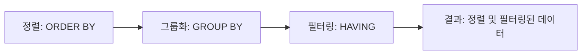

# 정렬 및 필터링 (Sorting & Filtering) 상세 사용 예시 및 실습

## 정렬 및 필터링 소개

정렬 및 필터링은 데이터를 특정 기준에 따라 정렬하거나 필터링하는 데 사용됩니다. 이 기법들은 데이터를 보다 의미 있고 유용한 방식으로 표시하는 데 도움을 줍니다.

### 주요 명령어

- **ORDER BY**: 결과를 특정 순서로 정렬합니다.
- **GROUP BY**: 특정 열의 값에 따라 데이터를 그룹화합니다.
- **HAVING**: GROUP BY와 함께 사용되어 그룹화된 결과에 조건을 적용합니다.

## 예시 쿼리 실습 및 분석

### 정렬 및 그룹화 예제
```sql
SELECT * FROM Employees ORDER BY Salary DESC;
SELECT Department, AVG(Salary) AS AverageSalary 
FROM Employees 
GROUP BY Department 
HAVING AVG(Salary) > 60000;
```

## 쿼리 진행 순서

1. **정렬**: `Employees` 테이블의 데이터를 급여에 따라 내림차순으로 정렬합니다.
2. **그룹화 및 필터링**: 각 부서별 평균 급여를 계산하고, 평균 급여가 60000 이상인 부서만 필터링합니다.

## 쿼리 진행도 (Mermaid)



정렬, 그룹화, 필터링을 통해 데이터를 보다 명확하고 유용하게 분석할 수 있습니다.
