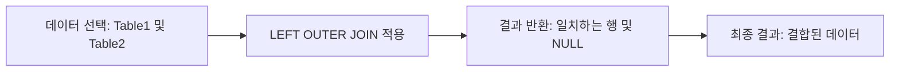

# LEFT OUTER JOIN 상세 사용 예시

## LEFT OUTER JOIN이란?

LEFT OUTER JOIN은 왼쪽 테이블의 모든 행과 오른쪽 테이블에서 일치하는 행을 반환하는 SQL 조인 유형입니다. 일치하는 행이 없는 경우, 오른쪽 테이블의 필드는 NULL 값으로 표시됩니다.

## 핵심 개념

- **왼쪽 테이블 기준**: 왼쪽 테이블의 모든 행이 결과에 포함됩니다.
- **일치하는 행 결합**: 오른쪽 테이블에서 일치하는 행이 있으면 결합됩니다.
- **일치하지 않는 경우 NULL 처리**: 오른쪽 테이블에서 일치하는 행이 없으면 해당 필드는 NULL로 표시됩니다.

## 예시 쿼리 분석

### LEFT OUTER JOIN 예제
```sql
SELECT 
    Table1.id,
    Table1.value,
    Table2.description
FROM 
    Table1
LEFT OUTER JOIN 
    Table2 
ON 
    Table1.id = Table2.id;
```

## 쿼리 진행 순서

1. **데이터 선택**: `Table1`과 `Table2`에서 필요한 컬럼을 선택합니다.
2. **LEFT OUTER JOIN 적용**: `Table1`을 기준으로 `Table2`와 조인합니다.
3. **결과 반환**: `Table1`의 모든 행과 `Table2`의 일치하는 행을 반환합니다. 일치하지 않는 경우 NULL로 표시됩니다.

## 쿼리 진행도 (Mermaid)



LEFT OUTER JOIN을 사용하면 왼쪽 테이블을 기준으로 관련 데이터를 결합하고, 일치하지 않는 경우에도 왼쪽 테이블의 데이터를 유지할 수 있습니다.
