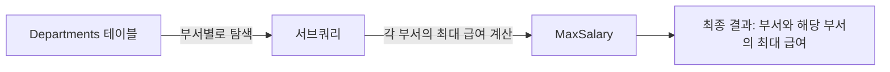

## 서브쿼리란?

서브쿼리(subquery)는 SQL 쿼리 내에 포함된 다른 쿼리입니다. 이를 통해 데이터 필터링, 복잡한 집계, 데이터 변환 등을 수행할 수 있습니다.

## 기본 개념

- **정의**: 서브쿼리는 메인 쿼리 안에 포함되어 있는 또 다른 쿼리입니다.
- **타입**: 단일 행 반환 서브쿼리와 다중 행 반환 서브쿼리가 있습니다.
- **위치**: SELECT, FROM, WHERE 절 등에서 사용됩니다.
- **용도**: 데이터 필터링, 복잡한 집계, 데이터 조인 등에 활용됩니다.

## 예시 쿼리

부서별로 최대 급여를 계산하는 쿼리입니다.

```sql
SELECT 
    Department,
    (SELECT MAX(Salary) FROM Employees WHERE Department = Departments.Department) AS MaxSalary
FROM 
    Departments;
```

## 쿼리 진행 순서

1. 메인 쿼리 `FROM Departments`가 모든 부서를 검색합니다.
2. 각 부서에 대해 서브쿼리가 `Employees` 테이블에서 해당 부서의 최대 급여(`MAX(Salary)`)를 찾습니다.
3. 서브쿼리의 결과는 메인 쿼리 결과와 결합되어 최종 결과를 형성합니다.

## 쿼리 진행도 (Mermaid)


