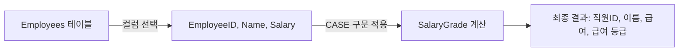

## 조건부 로직이란?

조건부 로직은 SQL에서 특정 조건에 따라 다른 결과를 출력하거나 데이터를 처리하는 데 사용됩니다. 주로 `CASE WHEN` 구문을 활용합니다.

## 기본 개념

- **정의**: 조건부 로직은 특정 조건에 따라 데이터를 다르게 처리하는 방법입니다.
- **구문**: `CASE` 구문은 조건부 로직을 구현하는 데 사용됩니다.
- **용도**: 데이터 분류, 새로운 계산된 컬럼 생성, 데이터 변환 등에 사용됩니다.

## 예시 쿼리

직원의 급여에 따라 급여 등급을 분류하는 쿼리입니다.

```sql
SELECT 
    EmployeeID,
    Name,
    Salary,
    CASE 
        WHEN Salary >= 60000 THEN 'High'
        WHEN Salary BETWEEN 40000 AND 59999 THEN 'Medium'
        ELSE 'Low'
    END AS SalaryGrade
FROM 
    Employees;
```

## 쿼리 진행 순서

1. 컬럼 선택: `EmployeeID`, `Name`, `Salary` 컬럼을 선택합니다.
2. 조건부 로직 적용: `CASE` 구문을 사용하여 각 직원의 급여에 따라 `SalaryGrade` 컬럼을 생성합니다.
    - 급여가 60,000 이상이면 `High`
    - 급여가 40,000과 59,999 사이면 `Medium`
    - 그 외의 경우에는 `Low`
3. 결과 반환: 조건에 따라 계산된 `SalaryGrade`와 다른 선택된 컬럼들과 함께 결과를 반환합니다.

## 쿼리 진행도 (Mermaid)


