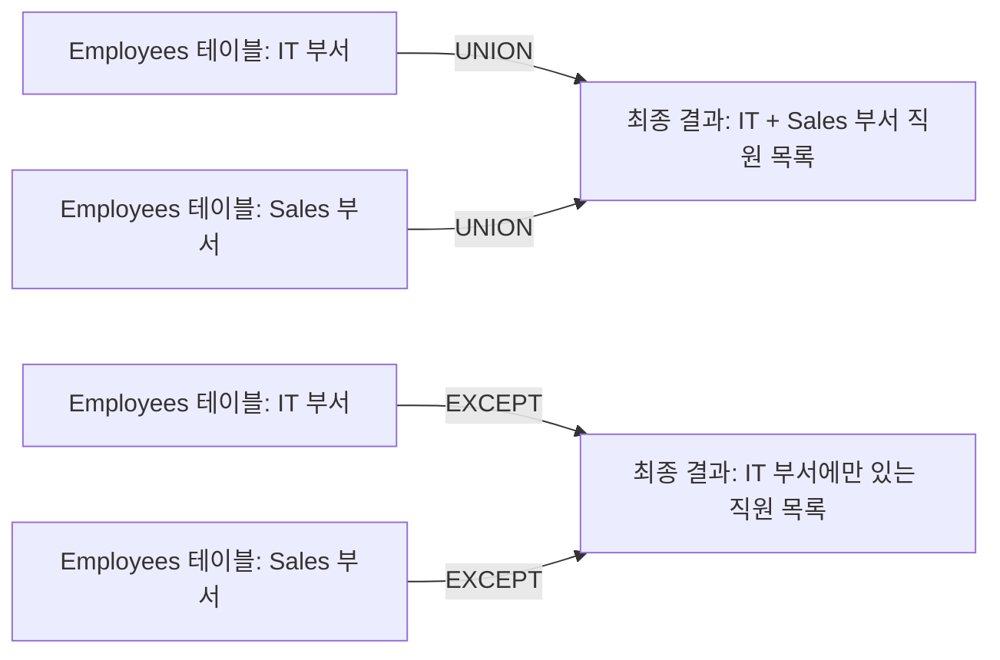

## 집합 연산이란?

집합 연산은 여러 쿼리 결과를 결합하는 방법입니다. `UNION`, `INTERSECT`, `EXCEPT` 등의 연산을 사용하여 다양한 데이터 집합을 생성할 수 있습니다.

## 기본 개념

- **UNION**: 두 개 이상의 쿼리 결과를 결합하여 중복을 제거한 단일 결과 집합을 생성합니다.
- **INTERSECT**: 두 쿼리 결과에서 공통되는 요소만을 선택하여 새로운 결과 집합을 생성합니다.
- **EXCEPT**: 첫 번째 쿼리 결과에서 두 번째 쿼리 결과를 제외한 요소들로 구성된 결과 집합을 생성합니다.

## 예시 쿼리

1. IT 부서와 Sales 부서 직원의 목록 (UNION)

```sql
SELECT Name FROM Employees WHERE Department = 'IT'
UNION
SELECT Name FROM Employees WHERE Department = 'Sales';
```

2. IT 부서에만 있는 직원의 목록 (EXCEPT)

```sql
SELECT Name FROM Employees WHERE Department = 'IT'
EXCEPT
SELECT Name FROM Employees WHERE Department = 'Sales';
```

## 쿼리 진행 순서

1. **UNION 쿼리**:
    - IT 부서의 직원을 선택합니다.
    - Sales 부서의 직원을 선택합니다.
    - 두 결과를 결합하여 중복 없는 직원 목록을 생성합니다.

2. **EXCEPT 쿼리**:
    - IT 부서의 직원을 선택합니다.
    - Sales 부서의 직원을 제외합니다.
    - 결과적으로 IT 부서에만 있는 직원의 목록을 생성합니다.

## 쿼리 진행도 (Mermaid)


