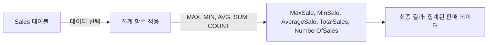

# 집계 함수 (Aggregate Functions) 사용 예시

## 집계 함수란?

집계 함수는 데이터 집합에 대한 계산을 수행하는 함수입니다. `COUNT`, `SUM`, `AVG`, `MIN`, `MAX` 등이 여기에 속합니다.

## 기본 개념

- **COUNT**: 데이터 집합의 항목 수를 계산합니다.
- **SUM**: 데이터 집합의 총합을 계산합니다.
- **AVG**: 데이터 집합의 평균값을 계산합니다.
- **MIN**: 데이터 집합에서 최소값을 찾습니다.
- **MAX**: 데이터 집합에서 최대값을 찾습니다.

## 예시 쿼리

총 판매량, 평균 판매량, 최대 및 최소 판매량을 계산하는 쿼리입니다.

```sql
SELECT 
    MAX(Amount) AS MaxSale,
    MIN(Amount) AS MinSale,
    AVG(Amount) AS AverageSale,
    SUM(Amount) AS TotalSales,
    COUNT(*) AS NumberOfSales
FROM 
    Sales;
```

## 쿼리 진행 순서

1. `FROM Sales`: `Sales` 테이블에서 데이터를 선택합니다.
2. `SELECT MAX(Amount) AS MaxSale, MIN(Amount) AS MinSale, AVG(Amount) AS AverageSale, SUM(Amount) AS TotalSales, COUNT(*) AS NumberOfSales`: 각 집계 함수를 사용하여 최대 판매량, 최소 판매량, 평균 판매량, 총 판매량, 그리고 판매 횟수를 계산합니다.
3. 결과 반환: 계산된 각 집계 값과 함께 결과를 반환합니다.

## 쿼리 진행도 (Mermaid)


