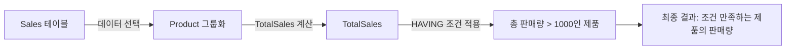

# HAVING 사용 예시

## HAVING이란?

`HAVING`은 `GROUP BY` 구문과 함께 사용되어 그룹화된 결과에 조건을 적용합니다. 이를 통해 특정 조건을 만족하는 그룹만을 필터링할 수 있습니다.

## 기본 개념

- **목적**: 그룹화된 결과에 조건을 적용하여 특정 그룹을 필터링합니다.
- **사용법**: `HAVING`은 주로 집계 함수와 함께 사용되며, `GROUP BY` 구문 다음에 위치합니다.
- **결과**: 조건을 만족하는 그룹만을 반환합니다.

## 예시 쿼리

특정 조건을 충족하는 판매 그룹을 찾는 쿼리입니다.

```sql
SELECT 
    Product,
    SUM(Amount) AS TotalSales
FROM 
    Sales
GROUP BY 
    Product
HAVING 
    SUM(Amount) > 1000;
```

## 쿼리 진행 순서

1. `FROM Sales`: `Sales` 테이블에서 데이터를 선택합니다.
2. `GROUP BY Product`: 제품별로 데이터를 그룹화합니다.
3. `SELECT Product, SUM(Amount) AS TotalSales`: 각 제품에 대한 총 판매량을 계산합니다.
4. `HAVING SUM(Amount) > 1000`: 총 판매량이 1000을 초과하는 제품 그룹만을 필터링합니다.
5. 결과 반환: 조건을 만족하는 제품과 해당 제품의 총 판매량을 포함하는 결과를 반환합니다.

## 쿼리 진행도 (Mermaid)


