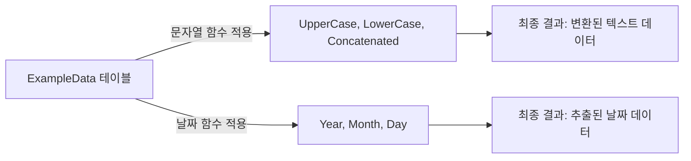

# 문자열 및 날짜 함수 (String and Date Functions) 사용 예시

## 문자열 및 날짜 함수란?

문자열 및 날짜 함수는 SQL에서 데이터 형식과 내용을 조작하는 데 사용됩니다. 이를 통해 데이터를 보다 유용한 형태로 변환하거나 요약할 수 있습니다.

## 기본 개념

- **문자열 함수**: 텍스트 데이터를 조작합니다. 예: `UPPER()`, `LOWER()`, `CONCAT()`.
- **날짜 함수**: 날짜 데이터에서 연도, 월, 일 등을 추출합니다. 예: `YEAR()`, `MONTH()`, `DAY()`.

## 예시 쿼리

### 문자열 함수 예제

```sql
SELECT 
    TextData,
    UPPER(TextData) AS UpperCase,
    LOWER(TextData) AS LowerCase,
    CONCAT(TextData, ' Data') AS Concatenated
FROM 
    ExampleData;
```

### 날짜 함수 예제

```sql
SELECT 
    DateData,
    YEAR(DateData) AS Year,
    MONTH(DateData) AS Month,
    DAY(DateData) AS Day
FROM 
    ExampleData;
```

## 쿼리 진행 순서

### 문자열 함수

1. `FROM ExampleData`: `ExampleData` 테이블에서 데이터를 선택합니다.
2. `SELECT TextData, UPPER(TextData), LOWER(TextData), CONCAT(TextData, ' Data')`: 텍스트 데이터에 대해 대문자 변환, 소문자 변환, 문자열 연결 등의 조작을 수행합니다.

### 날짜 함수

1. `FROM ExampleData`: `ExampleData` 테이블에서 데이터를 선택합니다.
2. `SELECT DateData, YEAR(DateData), MONTH(DateData), DAY(DateData)`: 날짜 데이터에서 연도, 월, 일을 추출합니다.

## 쿼리 진행도 (Mermaid)


