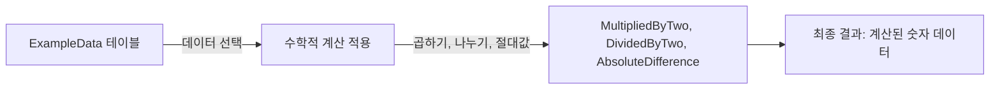

# 수학 함수 (Math Functions) 사용 예시

## 수학 함수란?

수학 함수는 SQL에서 수학적 계산을 수행하는 데 사용됩니다. 이러한 함수들을 통해 데이터에 대한 다양한 수학적 분석을 수행할 수 있습니다.

## 기본 개념

- **계산**: 데이터에 대한 기본적인 수학적 계산을 수행합니다.
- **함수 예시**: 곱하기(`*`), 나누기(`/`), 절대값(`ABS()`).

## 예시 쿼리

```sql
SELECT 
    NumberData,
    NumberData * 2 AS MultipliedByTwo,
    NumberData / 2 AS DividedByTwo,
    ABS(NumberData - 15) AS AbsoluteDifference
FROM 
    ExampleData;
```

## 쿼리 진행 순서

1. `FROM ExampleData`: `ExampleData` 테이블에서 데이터를 선택합니다.
2. `SELECT NumberData, NumberData * 2, NumberData / 2, ABS(NumberData - 15)`: 숫자 데이터에 대해 곱하기, 나누기, 절대값 차이를 계산합니다.
3. 결과 반환: 계산된 각 값을 포함하는 결과를 반환합니다.

## 쿼리 진행도 (Mermaid)


