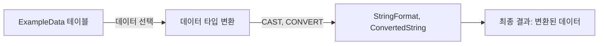

# 변환 함수 (Conversion Functions) 사용 예시

## 변환 함수란?

변환 함수는 SQL에서 데이터 타입을 변환하는 데 사용됩니다. `CAST`와 `CONVERT` 함수를 사용하면 다양한 데이터 타입 간의 변환을 수행할 수 있습니다.

## 기본 개념

- **CAST**: 하나의 데이터 타입을 다른 데이터 타입으로 변환합니다.
- **CONVERT**: `CAST`와 유사하지만, 데이터베이스 시스템에 따라 추가 옵션을 제공할 수 있습니다.

## 예시 쿼리

```sql
SELECT 
    NumberData,
    CAST(NumberData AS VARCHAR(10)) AS StringFormat,
    CONVERT(VARCHAR(10), NumberData) AS ConvertedString
FROM 
    ExampleData;
```

## 쿼리 진행 순서

1. `FROM ExampleData`: `ExampleData` 테이블에서 데이터를 선택합니다.
2. `SELECT NumberData, CAST(NumberData AS VARCHAR(10)), CONVERT(VARCHAR(10), NumberData)`: 숫자 데이터를 문자열 형식으로 변환합니다.
3. 결과 반환: 원본 숫자 데이터와 변환된 문자열 데이터를 포함하는 결과를 반환합니다.

## 쿼리 진행도 (Mermaid)


