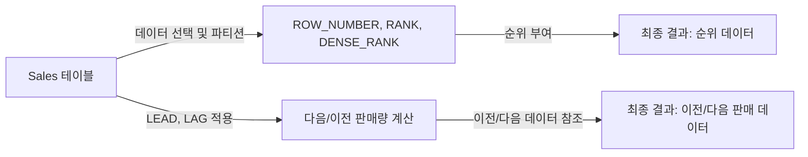

# 윈도우 함수 (Window Functions) 상세 사용 예시

## 윈도우 함수란?

윈도우 함수는 데이터를 특정 범위(윈도우) 내에서 그룹화하고 각 그룹에 대한 계산을 수행하는 SQL의 고급 기능입니다. 이러한 함수들은 복잡한 데이터 분석에 필수적입니다.

## 핵심 구성요소 및 작동 방식

### OVER
- OVER 절은 파티션별 데이터 연산을 위한 윈도우를 지정합니다. 이 절은 윈도우 함수가 적용될 데이터 범위를 정의합니다.

### PARTITION BY
- PARTITION BY 절은 데이터를 특정 컬럼을 기준으로 파티션으로 나눕니다. 같은 파티션 내의 데이터에 대해서만 함수가 적용됩니다.

### ROW_NUMBER, RANK, DENSE_RANK
- `ROW_NUMBER()`: 각 파티션 내에서 고유한 순서를 할당합니다.
- `RANK()`: 동일한 값을 가진 항목에 동일 순위를 부여하고, 다음 순위는 건너뜁니다.
- `DENSE_RANK()`: 동일한 값을 가진 항목에 동일 순위를 부여하지만, 순위를 건너뛰지 않습니다.

### LEAD, LAG
- `LEAD()`: 현재 행으로부터 지정된 수만큼 이후의 행을 참조합니다.
- `LAG()`: 현재 행으로부터 지정된 수만큼 이전의 행을 참조합니다.

## 예시 쿼리 분석

### ROW_NUMBER, RANK, DENSE_RANK 사용 예

```sql
SELECT 
    EmployeeID,
    Department,
    SaleAmount,
    ROW_NUMBER() OVER (PARTITION BY Department ORDER BY SaleAmount DESC) AS RowNum,
    RANK() OVER (PARTITION BY Department ORDER BY SaleAmount DESC) AS Rank,
    DENSE_RANK() OVER (PARTITION BY Department ORDER BY SaleAmount DESC) AS DenseRank
FROM 
    Sales;
```

### LEAD, LAG 사용 예

```sql
SELECT 
    EmployeeID,
    Department,
    SaleAmount,
    LEAD(SaleAmount, 1) OVER (PARTITION BY Department ORDER BY SaleDate) AS NextSale,
    LAG(SaleAmount, 1) OVER (PARTITION BY Department ORDER BY SaleDate) AS PrevSale
FROM 
    Sales;
```

## 쿼리 진행도 (Mermaid)



이러한 과정을 통해 복잡한 데이터 분석과 패턴 인식이 가능해집니다.
