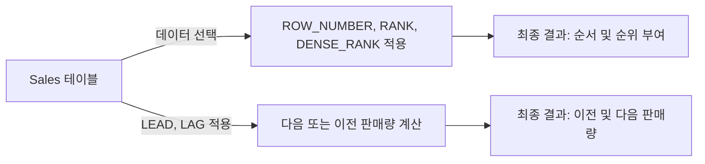

# 윈도우 함수 (Window Functions) 사용 예시

## 윈도우 함수란?

윈도우 함수는 데이터 분석에서 매우 유용한 SQL 기능으로, 특정 범위(윈도우) 내에서 데이터를 그룹화하고 각 그룹에 대한 계산을 수행합니다. 이러한 함수는 복잡한 데이터 분석을 위해 필수적입니다.

## 학습 내용

- **OVER**: 파티션별 데이터 연산을 위한 윈도우 지정.
- **PARTITION BY**: 특정 컬럼을 기준으로 데이터 파티션 나눔.
- **ROW_NUMBER, RANK, DENSE_RANK**: 각 파티션 내에서 순서나 순위 부여.
- **LEAD, LAG**: 다음 행이나 이전 행의 데이터에 접근.

## 예시 쿼리

### ROW_NUMBER, RANK, DENSE_RANK

```sql
SELECT 
    EmployeeID,
    Department,
    SaleAmount,
    ROW_NUMBER() OVER (PARTITION BY Department ORDER BY SaleAmount) AS RowNum,
    RANK() OVER (PARTITION BY Department ORDER BY SaleAmount) AS Rank,
    DENSE_RANK() OVER (PARTITION BY Department ORDER BY SaleAmount) AS DenseRank
FROM 
    Sales;
```

### LEAD, LAG

```sql
SELECT 
    EmployeeID,
    Department,
    SaleAmount,
    LEAD(SaleAmount, 1) OVER (PARTITION BY Department ORDER BY SaleDate) AS NextSale,
    LAG(SaleAmount, 1) OVER (PARTITION BY Department ORDER BY SaleDate) AS PrevSale
FROM 
    Sales;
```

## 쿼리 진행 순서

1. `FROM Sales`: `Sales` 테이블에서 데이터를 선택합니다.
2. `SELECT EmployeeID, Department, SaleAmount, ROW_NUMBER(), RANK(), DENSE_RANK()`: `ROW_NUMBER`, `RANK`, `DENSE_RANK`를 사용하여 각 부서별로 판매량 순서 및 순위를 부여합니다.
3. `SELECT EmployeeID, Department, SaleAmount, LEAD(), LAG()`: `LEAD`, `LAG`를 사용하여 각 부서별로 다음 또는 이전 판매량을 보여줍니다.
4. 결과 반환: 계산된 결과를 포함하여 반환합니다.

## 쿼리 진행도 (Mermaid)


