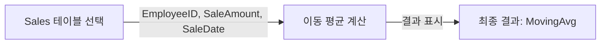
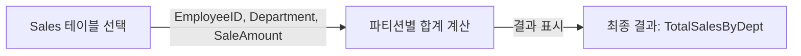
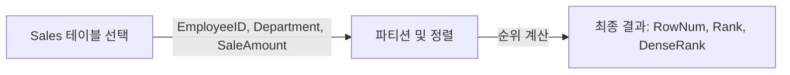
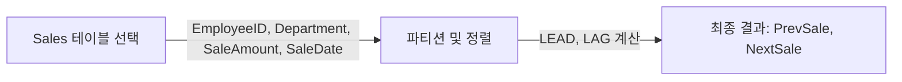

# 윈도우 함수 (Window Functions) 상세 사용 예시

## 윈도우 함수란?

윈도우 함수는 데이터를 특정 범위(윈도우) 내에서 그룹화하고 각 그룹에 대한 계산을 수행하는 SQL의 고급 기능입니다. 이러한 함수들은 복잡한 데이터 분석에 필수적입니다.

## 핵심 구성요소 및 작동 방식

### 1. OVER 절
- `OVER` 절은 윈도우 함수가 작동하는 행의 집합 또는 윈도우를 정의합니다.
- 예제 쿼리: 
  ```sql
  SELECT 
      EmployeeID, 
      SaleAmount,
      AVG(SaleAmount) OVER (ORDER BY SaleDate ROWS BETWEEN 1 PRECEDING AND 1 FOLLOWING) AS MovingAvg
  FROM 
      Sales;```

### 쿼리 진행 순서 및 데이터 흐름:
1. Sales 테이블에서 EmployeeID, SaleAmount, SaleDate를 선택합니다.
2. 각 행에 대해, 전후 1행을 포함한 윈도우 내에서 SaleAmount의 평균을 계산합니다.
3. 계산된 이동 평균을 MovingAvg로 표시합니다.

### 쿼리 진행도 (Mermaid)



### 2. PARTITION BY
- PARTITION BY 절은 데이터를 특정 컬럼의 값에 따라 여러 파티션으로 나눕니다.
- 예제 쿼리: 
  ```sql
    SELECT 
        EmployeeID, 
        Department, 
        SaleAmount,
        SUM(SaleAmount) OVER (PARTITION BY Department) AS TotalSalesByDept
    FROM 
        Sales;```
### 쿼리 진행 순서 및 데이터 흐름:
1. Sales 테이블에서 EmployeeID, Department, SaleAmount를 선택합니다.
2. Department별로 데이터를 파티션하고, 각 파티션 내에서 SaleAmount의 합계를 계산합니다.
3. 계산된 합계를 TotalSalesByDept로 표시합니다.

### 쿼리 진행도 (Mermaid)


### 3. ROW_NUMBER, RANK, DENSE_RANK
- `ROW_NUMBER()`: 각 파티션 내에서 고유한 순서를 할당합니다.
- `RANK()`: 동일한 값을 가진 항목에 동일 순위를 부여하고, 다음 순위는 건너뜁니다.
- `DENSE_RANK()`: 동일한 값을 가진 항목에 동일 순위를 부여하지만, 순위를 건너뛰지 않습니다.
- 예제 쿼리: 
  ```sql
    SELECT 
        EmployeeID, 
        Department, 
        SaleAmount,
        ROW_NUMBER() OVER (PARTITION BY Department ORDER BY SaleAmount DESC) AS RowNum,
        RANK() OVER (PARTITION BY Department ORDER BY SaleAmount DESC) AS Rank,
        DENSE_RANK() OVER (PARTITION BY Department ORDER BY SaleAmount DESC) AS DenseRank
    FROM 
        Sales;```
### 쿼리 진행 순서 및 데이터 흐름:
1. Sales 테이블에서 EmployeeID, Department, SaleAmount를 선택합니다.
2. Department별로 데이터를 파티션하고, 각 파티션 내에서 SaleAmount를 기준으로 내림차순 정렬합니다.
3. 각 정렬된 행에 대해 ROW_NUMBER, RANK, DENSE_RANK를 계산합니다.
4. 계산된 순위들을 각각 RowNum, Rank, DenseRank로 표시합니다.

### 쿼리 진행도 (Mermaid)



### 4. LEAD, LAG
- `LEAD()`: 현재 행으로부터 지정된 수만큼 이후의 행을 참조합니다.
- `LAG()`: 현재 행으로부터 지정된 수만큼 이전의 행을 참조합니다.
- 예제 쿼리: 
    ```sql
    SELECT 
        EmployeeID, 
        Department, 
        SaleAmount,
        LEAD(SaleAmount, 1) OVER (PARTITION BY Department ORDER BY SaleDate) AS NextSale,
        LAG(SaleAmount, 1) OVER (PARTITION BY Department ORDER BY SaleDate) AS PrevSale
    FROM 
        Sales;
    ```
### 쿼리 진행 순서 및 데이터 흐름:
1. Sales 테이블에서 EmployeeID, Department, SaleAmount, SaleDate를 선택합니다.
2. Department별로 데이터를 파티션하고, SaleDate를 기준으로 정렬합니다.
3. 각 행에 대해 LEAD와 LAG 함수를 사용하여 다음 및 이전 판매량을 계산합니다.
4. 계산된 이전 및 다음 판매량을 PrevSale 및 NextSale로 표시합니다.

### 쿼리 진행도 (Mermaid)


이러한 과정을 통해 복잡한 데이터 분석과 패턴 인식이 가능해집니다.
