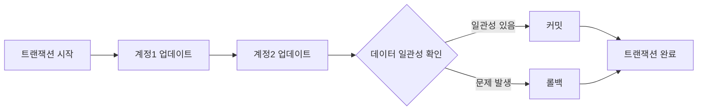

# 트랜잭션 관리 (Transaction Management) 상세 설명

## 트랜잭션 관리란?

트랜잭션 관리는 데이터베이스에서 데이터의 일관성과 정확성을 유지하는 중요한 역할을 합니다. 트랜잭션은 데이터베이스 작업의 완전성을 보장하기 위해 사용되며, 오류가 발생하면 원래 상태로 롤백됩니다.

## 핵심 구성요소

- **BEGIN TRANSACTION**: 트랜잭션의 시작을 알립니다.
- **COMMIT**: 트랜잭션 내의 모든 변경 사항을 데이터베이스에 영구적으로 적용합니다.
- **ROLLBACK**: 트랜잭션 내의 모든 변경 사항을 취소하고, 데이터를 트랜잭션 시작 전의 상태로 되돌립니다.
- **TRANSACTION ISOLATION LEVEL**: 다른 트랜잭션과의 격리 수준을 설정합니다.

## 예시 쿼리 분석

```sql
BEGIN TRANSACTION;

UPDATE Accounts SET balance = balance - 100 WHERE account_id = 1;
UPDATE Accounts SET balance = balance + 100 WHERE account_id = 2;

COMMIT;

ROLLBACK;
```

## 쿼리 진행 순서

1. `BEGIN TRANSACTION`: 트랜잭션이 시작됩니다.
2. `UPDATE Accounts SET balance = balance - 100 WHERE account_id = 1;`: 첫 번째 계정의 잔액을 100만큼 감소시킵니다.
3. `UPDATE Accounts SET balance = balance + 100 WHERE account_id = 2;`: 두 번째 계정의 잔액을 100만큼 증가시킵니다.
4. `COMMIT;`: 변경 사항을 데이터베이스에 반영합니다.
5. `ROLLBACK;`: 문제가 발생한 경우, 변경 사항을 취소하고 원래 상태로 되돌립니다.

## 쿼리 진행도 (Mermaid)



이러한 트랜잭션 관리를 통해 데이터의 정확성과 안정성을 보장할 수 있습니다.
