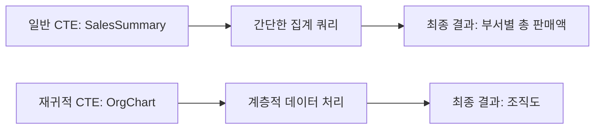

# 공통 테이블 표현식 (CTE) 및 재귀적 CTE 상세 사용 예시

## CTE 및 재귀적 CTE 개요

공통 테이블 표현식(CTE)은 SQL 쿼리를 단순하고 가독성 높은 부분으로 분리하는 데 사용됩니다. 재귀적 CTE는 계층적 데이터 구조의 처리에 특히 유용합니다.

## CTE와 재귀적 CTE의 차이점

### 일반 CTE
- 일반 CTE는 쿼리의 임시 결과 집합을 정의합니다.
- 복잡한 쿼리를 단순화하고, 가독성을 높이며, 코드 중복을 줄일 수 있습니다.
- 일반적으로 데이터 집계, 서브쿼리 대체, 임시 테이블 생성 등에 사용
- 예: 간단한 집계 또는 필터링을 위한 쿼리

### 재귀적 CTE
- 재귀적 CTE는 자기 자신을 참조하여 반복적으로 데이터를 처리합니다.
- 계층적 데이터 구조(예: 조직도, 카테고리 계층)를 쿼리하는 데 이상적입니다.
- 예: 조직도에서 직원과 그들의 관리자 관계를 나타내는 쿼리

## 예시 쿼리 분석

### 일반 CTE 예제
```sql
WITH SalesSummary AS (
    SELECT Department, SUM(SaleAmount) AS TotalSales
    FROM Sales
    GROUP BY Department
)
SELECT * FROM SalesSummary;
```

### 재귀적 CTE 예제
```sql
WITH RECURSIVE OrgChart AS (
    SELECT EmployeeID, Name, ManagerID
    FROM Employees
    WHERE ManagerID IS NULL
    UNION ALL
    SELECT e.EmployeeID, e.Name, e.ManagerID
    FROM Employees e
    INNER JOIN OrgChart o ON e.ManagerID = o.EmployeeID
)
SELECT * FROM OrgChart;
```

## 쿼리 진행도 (Mermaid)



CTE는 복잡한 쿼리를 단순화하는 데 도움을 주며, 재귀적 CTE는 계층적 데이터 구조의 처리에 특히 유용합니다.
