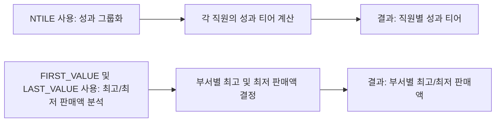

# 윈도우 함수 (Window Functions) 상세 사용 예시 및 분석

## 윈도우 함수 개요

윈도우 함수는 SQL 쿼리 내에서 특정 데이터 부분에 대한 계산을 수행하는 고급 기능입니다. 이를 통해 데이터 분석과 집계 작업을 효율적으로 수행할 수 있습니다.

## 핵심 개념

### 윈도우 함수의 개념 이해
- 윈도우 함수는 쿼리 결과 집합의 각 행에 대해 다른 행과의 관계를 고려하여 계산을 수행합니다.
- 이는 쿼리의 특정 부분(윈도우)에 대한 집계, 순위 결정, 분석 등을 가능하게 합니다.

### 다양한 윈도우 함수 탐구
- **NTILE**: 데이터를 지정된 수의 분위로 나누는 함수입니다.
- **FIRST_VALUE, LAST_VALUE**: 각 그룹 내에서 첫 번째나 마지막 값을 반환합니다.

## 예시 쿼리 및 분석

### 예제 1: NTILE을 사용한 성과 기준 그룹화
```sql
SELECT 
    EmployeeID, 
    SaleAmount, 
    NTILE(4) OVER (ORDER BY SaleAmount DESC) AS PerformanceTier
FROM Sales;
```
- **분석**: 이 쿼리는 전체 직원을 성과(판매액)에 따라 4개의 그룹으로 나눕니다. 각 그룹은 성과 상위 25%의 직원들로 구성됩니다.

### 예제 2: FIRST_VALUE와 LAST_VALUE
```sql
SELECT 
    Department,
    SaleAmount,
    FIRST_VALUE(SaleAmount) OVER (PARTITION BY Department ORDER BY SaleAmount DESC) AS HighestSale,
    LAST_VALUE(SaleAmount) OVER (PARTITION BY Department ORDER BY SaleAmount DESC RANGE BETWEEN UNBOUNDED PRECEDING AND UNBOUNDED FOLLOWING) AS LowestSale
FROM Sales;
```
- **분석**: 이 쿼리는 각 부서별로 최고 및 최저 판매액을 동시에 찾습니다. FIRST_VALUE는 가장 높은 판매액, LAST_VALUE는 가장 낮은 판매액을 반환합니다.

## 쿼리 진행도 (Mermaid)



이 분석을 통해 윈도우 함수가 복잡한 데이터 집계와 분석 작업을 어떻게 간소화하는지 이해할 수 있습니다.
